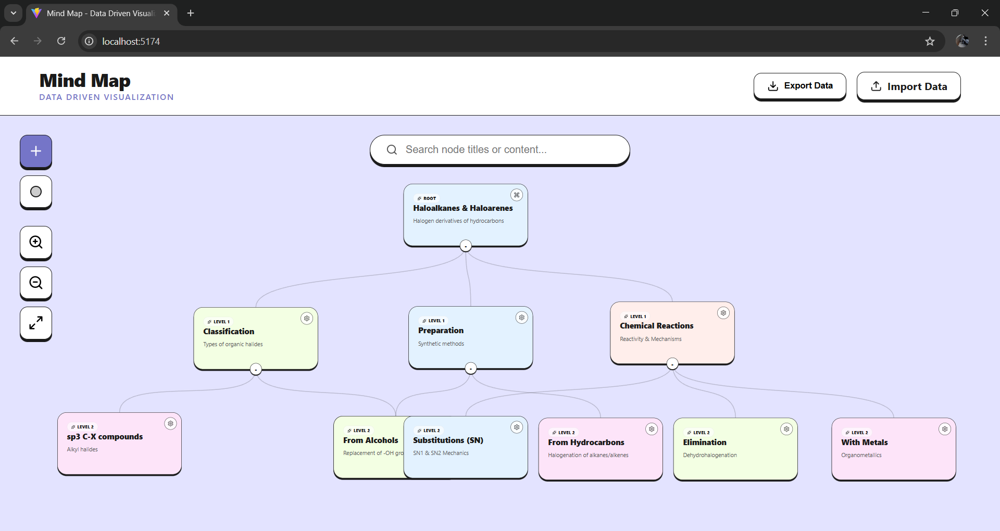
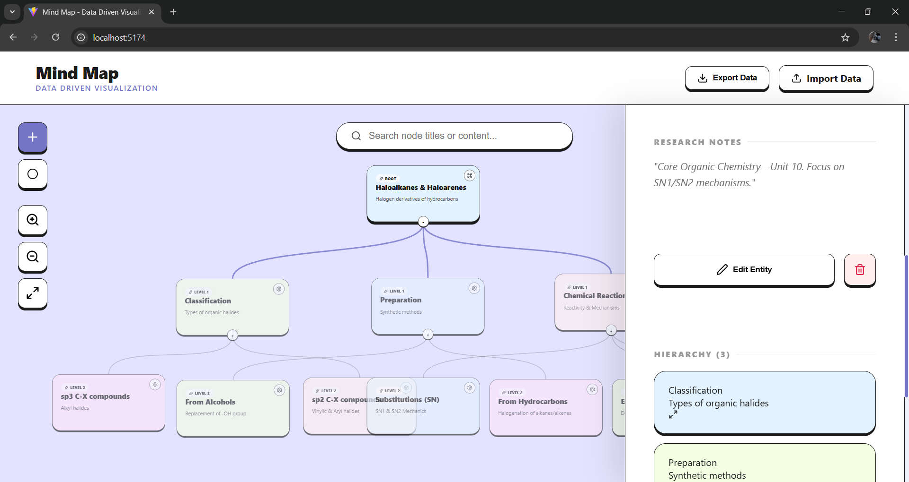
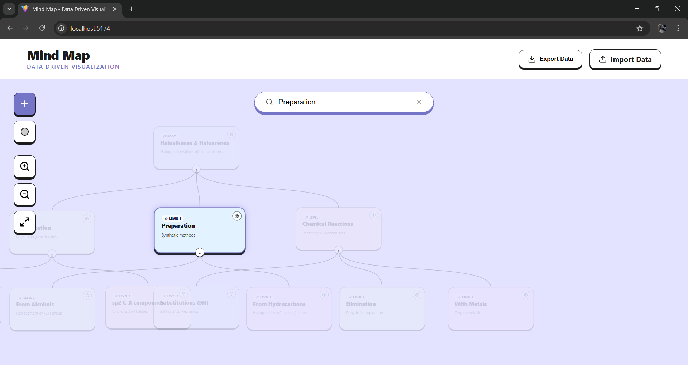
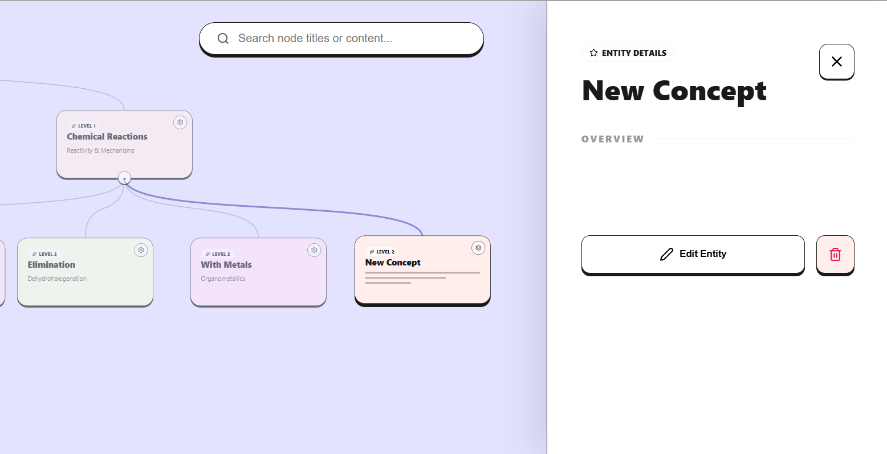
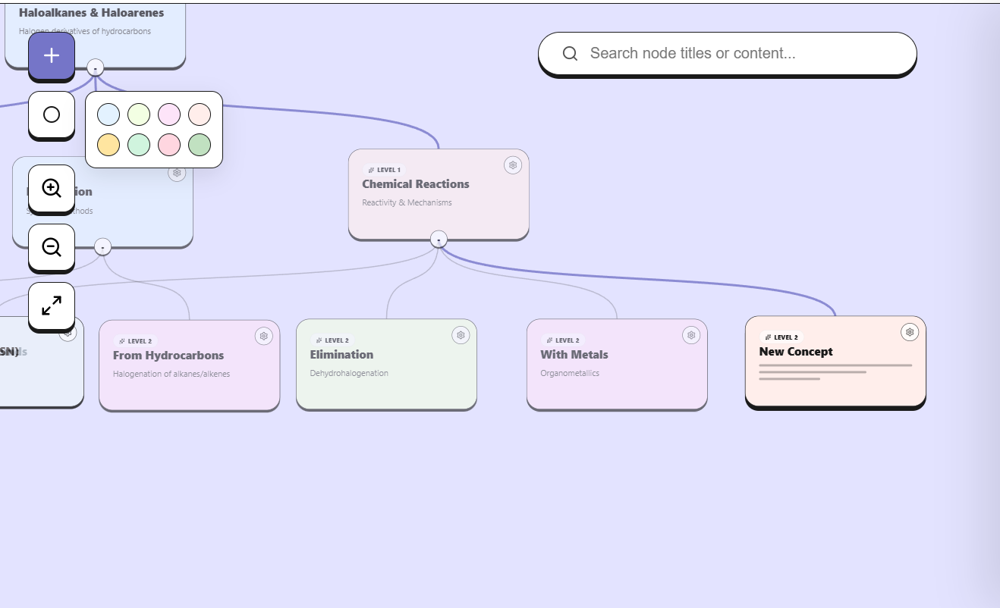

# Mind Map - Data Driven Visualization

A professional hierarchical visualization tool built for the **Frontend Development Internship Assignment**. This project focuses on rendering complex data structures into an interactive, user-friendly mind map.

### 📁 Project Structure
```
mind-map/
├── public/
│   └── vite.svg
├── demo-images/                # Showcase of application features
│   ├── workspace-overview.png
│   ├── sidebar-details.png
│   ├── search-functionality.png
│   ├── add-new-node.png
│   └── color-palette.png
├── src/
│   ├── data/
│   │   └── mind-map.json       # Source of truth for mindmap data
│   ├── App.jsx                 # Main application logic & UI
│   ├── index.css               # Global design tokens
│   └── main.jsx                # Application entry point
├── index.html
├── package.json
└── README.md
```

## ✨ Key Features

*   **Recursive Engine**: Automatically calculates node positions based on hierarchical depth and sibling count.
*   **Interactive Canvas**: Smooth infinite panning and zooming (Ctrl + Scroll) for navigating large data sets.
*   **Draggable Nodes**: Reposition any node manually; connection lines (Bezier curves) update dynamically in real-time.
*   **Data Portability**: 
    - **Export**: Save your current layout and edits into a portable JSON file.
    - **Import**: Load external JSON data to reconstruct mind maps instantly.

## 🎨 UI/UX Features

*   **Smooth Animations**: Features staggered entry animations for sidebar elements and fluid transitions for canvas adjustments.
*   **Contextual Insight Tooltips**: Hover over any node to see metadata and quick summaries without clicking.
*   **Responsive Viewport**: The engine automatically centers the visualization on window resize for a consistent experience.
*   **Intuitive Controls**: High-contrast, bold design system with clear visual feedback for hover, select, and drag actions.
*   **Glassmorphic Design**: A modern, clean sidebar for deep metadata editing and focused research notes.

## 🛠️ Functional Capabilities

*   **Dynamic Creation**: Add new sub-concepts on the fly using the built-in "Add Node" functionality.
*   **Personalization**: Use the custom Color Palette to categorize or highlight specific nodes with different styles.
*   **Smart Search**: Instantly filter through the map; non-matching nodes dim to provide clear visual focus on search results.
*   **Node Management**: Fully integrated Edit and Delete (with recursive removal) capabilities for complete data control.
*   **Branch Management**: Expand or collapse entire branches with a single click to manage complex hierarchies.

## 📺 Application Walkthrough

Check out the full interactive experience and feature walkthrough in the video below:

<div align="center">
  <a href="https://vimeo.com/1150854048" target="_blank">
    
    <br />
    <br />
    <strong>[ ▶ Click Here to Watch the Full Video Walkthrough ]</strong>
  </a>
</div>

## 📸 Application Demos

### 1. Interactive Workspace Overview


### 2. Detailed Node Information & Sidebar


### 3. Smart Search & Filter System


### 4. Dynamic Node Creation


### 5. Customizable Color Themes


## 💻 Technologies Used

*   **React 19** - Utilized for its robust component-based architecture and efficient state-driven UI rendering.
*   **Vite** - Serving as the next-generation build tool for ultra-fast development and optimized asset bundling.
*   **SVG Engine** - A custom-built SVG layer handles the complex coordinate math for zooming, panning, and dynamic node connections.
*   **Vanilla CSS** - A bespoke design system focused on high-performance animations, glassmorphism, and a polished premium aesthetic.

## 📚 Libraries Used

*   **Lucide React**: Integrated to provide a consistent, high-quality iconography set. *Why?* It offers a lightweight footprint and highly customizable SVG-based icons that align perfectly with the app's professional design language.
*   **React Hooks**: Extensive use of `useMemo` for layout performance, `useRef` for canvas manipulation, and `useEffect` for data synchronization. *Why?* To ensure the complex tree calculations don't bottleneck the main UI thread.

## 🏗️ Overall Architecture

The application is architected around a **Data-First Rendering Pattern**:

1.  **Centralized State Hub**: The entire mind map structure is treated as a single hierarchical state object. This ensures data integrity across deletions, moves, and edits.
2.  **Recursive Layout Engine**: A decoupled logic layer that translates the nested JSON tree into a 2D coordinate system. It calculates spacing and positions based on hierarchy depth and sibling density.
3.  **Coordinate Transformation Layer**: A math-heavy implementation that manages the global `pan` and `scale` states, transforming the SVG viewport for infinite canvas navigation.
4.  **Persistent Storage Strategy**: Every state change is automatically synced to `localStorage`, providing a "close and resume" experience that feels like a native desktop application.

## 🔄 Data Flow: From JSON to UI

The journey of data within the application follows a predictable, unidirectional flow:

1.  **Source Initialization**: Data is pulled from `mind-map.json` or hydrated from `localStorage` upon the first mount.
2.  **Recursive Transformation**: The raw tree is passed through `calculateLayout()`, which performs a depth-first search to assign specific spatial coordinates to every node.
3.  **Edge Resolution**: The engine identifies parent-child links in the transformed data and generates "Edges" (SVG Bezier paths) to visualize the relationships.
4.  **SVG-HTML Hybrid Rendering**: 
    - **Back-end Layer**: SVG handles the lines and the global canvas transform.
    - **Front-end Layer**: React maps the flattened node list into HTML `foreignObject` cards, allowing for rich CSS layouts and complex interactions inside the SVG.
5.  **User Feedback Loop**: Interactions (like dragging or editing) modify the underlying state, which triggers a near-instant recalculation of the layout, closing the loop between data and visualization.

## 🚀 Getting Started

1.  **Clone the project**
2.  **Install dependencies**:
    ```bash
    npm install
    ```
3.  **Run the development server**:
    ```bash
    npm run dev
    ```


---
*Developed as part of a Frontend Engineering Assignment.*
